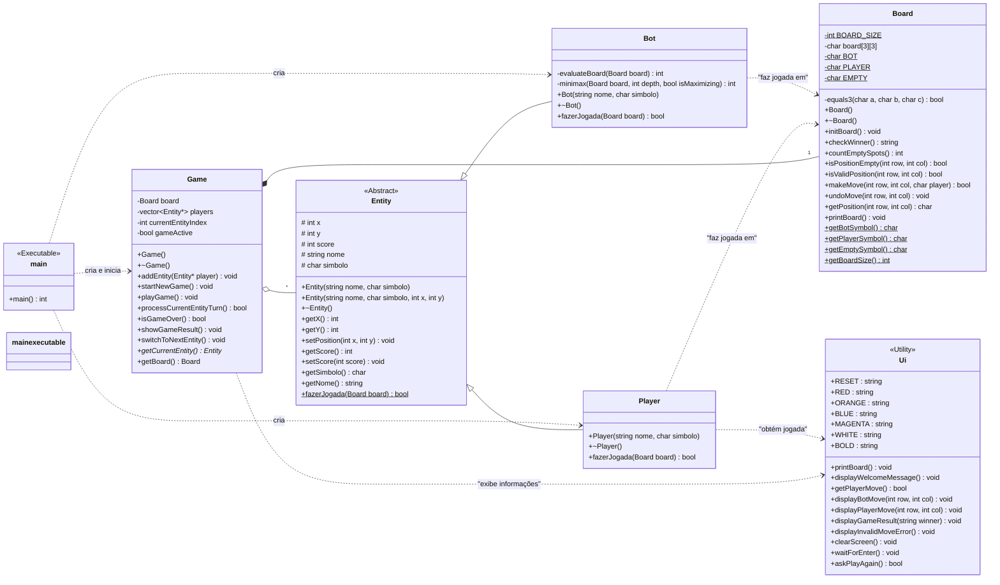

```mermaid
classDiagram
    direction LR

    %% --- Definição de Estilos ---
    classDef default stroke:#333,stroke-width:2px,color:black
    classDef abstract fill:#f9f9f9,stroke:#333,stroke-width:2px,color:black
    classDef executable fill:#e6ffed,stroke:#28a745,stroke-width:2px
    classDef utility fill:#f0f8ff,stroke:#6c757d,stroke-width:1px,stroke-dasharray: 5 5

    %% --- Ponto de Entrada da Aplicação ---
    class main {
        <<Executable>>
        +main() int
    }
    class main executable

    %% --- Definição das Classes ---
    class Entity {
        <<Abstract>>
        # int x
        # int y
        # int score
        # string nome
        # char simbolo
        +Entity(string nome, char simbolo)
        +Entity(string nome, char simbolo, int x, int y)
        +~Entity()
        +getX() int
        +getY() int
        +setPosition(int x, int y) void
        +getScore() int
        +setScore(int score) void
        +getSimbolo() char
        +getNome() string
        +fazerJogada(Board board) bool$
    }
    %%class Entity abstract

    class Player{
        +Player(string nome, char simbolo)
        +~Player()
        +fazerJogada(Board board) bool
    }

    
    class Bot {
        -evaluateBoard(Board board) int
        -minimax(Board board, int depth, bool isMaximizing) int
        +Bot(string nome, char simbolo)
        +~Bot()
        +fazerJogada(Board board) bool
    }

    
    class Board {
        -int BOARD_SIZE$
        -char board[3][3]
        -char BOT$
        -char PLAYER$
        -char EMPTY$
        -equals3(char a, char b, char c) bool
        +Board()
        +~Board()
        +initBoard() void
        +checkWinner() string
        +countEmptySpots() int
        +isPositionEmpty(int row, int col) bool
        +isValidPosition(int row, int col) bool
        +makeMove(int row, int col, char player) bool
        +undoMove(int row, int col) void
        +getPosition(int row, int col) char
        +printBoard() void
        +getBotSymbol() char$
        +getPlayerSymbol() char$
        +getEmptySymbol() char$
        +getBoardSize() int$
    }

    class Game {
        -Board board
        -vector~Entity*~ players
        -int currentEntityIndex
        -bool gameActive
        +Game()
        +~Game()
        +addEntity(Entity* player) void
        +startNewGame() void
        +playGame() void
        +processCurrentEntityTurn() bool
        +isGameOver() bool
        +showGameResult() void
        +switchToNextEntity() void
        +getCurrentEntity() Entity*
        +getBoard() Board
    }

    class Ui {
        <<Utility>>
        +RESET : string
        +RED : string
        +ORANGE : string
        +BLUE : string
        +MAGENTA : string
        +WHITE : string
        +BOLD : string
        +printBoard() void
        +displayWelcomeMessage() void
        +getPlayerMove() bool
        +displayBotMove(int row, int col) void
        +displayPlayerMove(int row, int col) void
        +displayGameResult(string winner) void
        +displayInvalidMoveError() void
        +clearScreen() void
        +waitForEnter() void
        +askPlayAgain() bool
    }

    %% --- Relacionamentos ---
    Entity <|-- Player
    Entity <|-- Bot
    Game *-- "1" Board
    Game o-- "*" Entity
    main ..> Game : cria e inicia
    main ..> Player : cria
    main ..> Bot : cria
    Player ..> Board : "faz jogada em"
    Bot ..> Board : "faz jogada em"
    Game ..> Ui : "exibe informações"
    Player ..> Ui : "obtém jogada"
```